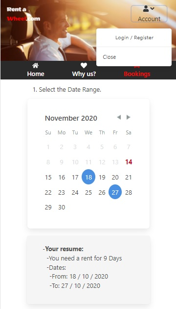
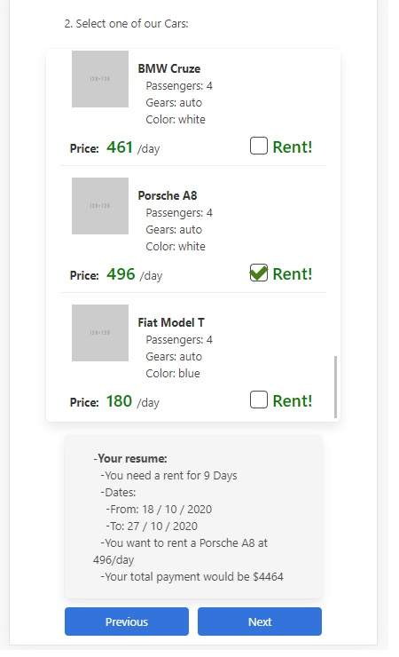

# About this:

This is a web for rent automobiles.
This an hybrid Backend, delivers a React app and then behaves like an api serving json from its database as needed.

### To install this package:

<ol>
<li>Yarn install, in root directory, to install depencencies.</li>
<li>In View direcroty, yarn install (it's a create-react-app package).</li>
<li>In view Directory, yarn build to interact with the backend, the build directory is what interacts with the backcend.</li>
</ol>

### To run this package in development:

<ol>
<li>Yarn start in View directory to develop client side in isolation.</li>
<li>Yarn dev in ROOT directoy to develop tha backend.
</li>

</ol>

## Backend

```json
{
  "name": "car-rent-software",
  "version": "1.0.0",
  "description": "A rent car software managment system",
  "main": "program.ts",
  "author": "jbovone <bovonejulian@gmail.com>",
  "license": "MIT",
  "private": false,
  "dependencies": {
    "connect-session-sequelize": "^7.0.4",
    "cors": "^2.8.5",
    "dotenv": "^8.2.0",
    "express": "^4.17.1",
    "express-session": "^1.17.1",
    "nodemailer": "^6.4.14",
    "rsdi": "^1.0.5",
    "sequelize": "^6.3.5",
    "sequelize-typescript": "^1.1.0",
    "sqlite3": "^5.0.0",
    "uuid": "^8.3.1"
  },
  "scripts": {
    "start": "node dist/Program.js",
    "dev": "ts-node-dev --respawn src/Program.ts",
    "build": "tsc",
    "test": "jest",
    "gen": "node tests/mockups.gen"
  },
  "devDependencies": {
    "@babel/core": "^7.12.1",
    "@babel/preset-env": "^7.12.1",
    "@babel/preset-typescript": "^7.12.1",
    "@types/cors": "^2.8.8",
    "@types/express": "^4.17.8",
    "@types/express-serve-static-core": "^4.17.13",
    "@types/express-session": "^1.17.0",
    "@types/jest": "^26.0.14",
    "@types/node": "^14.11.8",
    "@types/nodemailer": "^6.4.0",
    "@types/uuid": "^8.3.0",
    "babel-jest": "^26.5.2",
    "faker": "^5.1.0",
    "jest": "^26.5.3",
    "prettier": "^2.1.2",
    "ts-jest": "^26.4.1",
    "ts-node": "^9.0.0",
    "ts-node-dev": "^1.0.0-pre.65",
    "typescript": "^4.0.3"
  }
}
```

## Frontend

```json
{
  "name": "web",
  "version": "0.1.0",
  "private": true,
  "dependencies": {
    "@emotion/core": "^10.0.35",
    "@emotion/styled": "^10.0.27",
    "@testing-library/jest-dom": "^4.2.4",
    "@testing-library/react": "^9.3.2",
    "@testing-library/user-event": "^7.1.2",
    "axios": "^0.21.0",
    "bulma": "^0.9.1",
    "formik": "^2.2.0",
    "node-sass": "^4.14.1",
    "react": "^16.13.1",
    "react-day-picker": "^7.4.8",
    "react-dom": "^16.13.1",
    "react-icons": "^3.11.0",
    "react-redux": "^7.2.1",
    "react-router-dom": "^5.2.0",
    "react-scripts": "3.4.3",
    "react-table": "^7.6.0",
    "redux": "^4.0.5",
    "redux-thunk": "^2.3.0",
    "yup": "^0.29.3"
  },
  "scripts": {
    "start": "react-scripts start",
    "build": "react-scripts build",
    "test": "react-scripts test",
    "eject": "react-scripts eject"
  },
  "eslintConfig": {
    "extends": "react-app"
  },
  "browserslist": {
    "production": [">0.2%", "not dead", "not op_mini all"],
    "development": ["last 1 chrome version", "last 1 firefox version", "last 1 safari version"]
  },
  "devDependencies": {
    "@types/react-redux": "^7.1.11",
    "@types/react-router-dom": "^5.1.6",
    "faker": "^5.1.0"
  }
}
```




